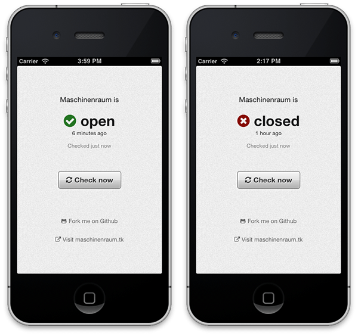

MR Door
=======

MR Door is a tiny web app that allows you to check the status of the
[twittering Maschinenraum door](https://twitter.com/intent/user?screen_name=mr_door_status).
Maschinenraum is a [Hackerspace based in Weimar, Germany](http://maschinenraum.tk).
There’s a publicly hosted version available at [mrdoor.paddd.de](http://mrdoor.paddd.de)

You’re encouraged to [add the app to your homescreen](http://www.apple.com/ios/add-to-home-screen/)
which will give you the look and feel of a native app.

  

